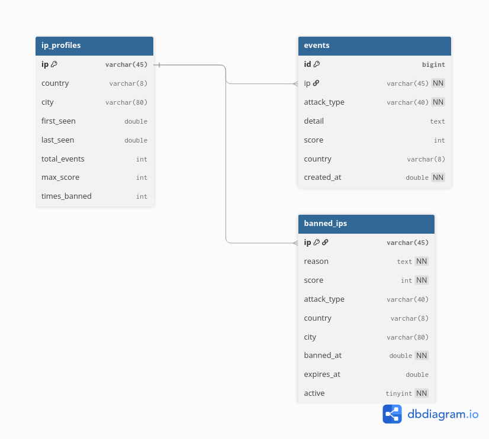

# Adaptive Firewall System

Kali Linux üzerinde çalışan, gerçek zamanlı log analizi yapan, çok sinyalli
risk puanlama kullanan ve otomatik IP engelleme gerçekleştiren üç katmanlı
adaptif güvenlik duvarı sistemi.

## Mimari

Sistem üç katmandan oluşur:

- **Katman 1 — Tespit (detector.py):** Log dosyalarını regex tabanlı pattern
  eşleştirme ile analiz eder. 9 saldırı türü tespit eder.
- **Katman 2 — Puanlama (scorer.py):** Tespit edilen olayları çok sinyalli bir
  algoritmayla 0-100 arası puanlar.
- **Katman 3 — Engelleme (blocker.py):** Risk eşiğini aşan IP'leri nftables ile
  işletim sistemi seviyesinde engeller.

## Tespit Edilen Saldırı Türleri

Brute force, yavaş brute force, port tarama, DDoS/flood, XSS, SQL injection,
path traversal, komut enjeksiyonu, kötü bot ve honeypot tuzakları.

## ER DİYAGRAM



## Kurulum

### Gereksinimler

- Python 3.8+
- Node.js 18+
- nftables (Kali Linux'ta varsayılan kurulu)

### Bağımlılıklar

```bash
# Site bağımlılıkları
cd site && npm install && cd ..

# Dashboard bağımlılıkları
cd dashboard && npm install && cd ..
```

## Çalıştırma

### Tek komutla (önerilen)

```bash
bash start.sh
```

Root ile çalıştırılırsa nftables ile gerçek engelleme yapılır.
Root değilse dry-run modunda (sadece tespit) çalışır.

```bash
sudo bash start.sh    # canlı mod
```

### Manuel

```bash
# Terminal 1 - Hedef site
cd site && node server.js

# Terminal 2 - Güvenlik duvarı
sudo python3 main.py --log site/access.log

# Terminal 3 - Dashboard
cd dashboard && node server.js
```

## Erişim

- Hedef site: http://localhost:3000
- Dashboard: http://localhost:4000

## Saldırı Testi

Sistemi test etmek için saldırı simülatörü kullanılır:

```bash
python3 simulator/attack_sim.py            # interaktif menü
python3 simulator/attack_sim.py --all      # tüm saldırılar
python3 simulator/attack_sim.py --brute    # tek saldırı türü
```

Simülatör, hedef siteye farklı IP'lerden geliyormuş gibi gerçekçi saldırı
trafiği üretir. Güvenlik duvarı bu saldırıları tespit edip engeller,
sonuçlar dashboard'da gerçek zamanlı görüntülenir.

## Durdurma

```bash
bash stop.sh
```

## Lisans

Bitirme projesi kapsamında geliştirilmiştir.
